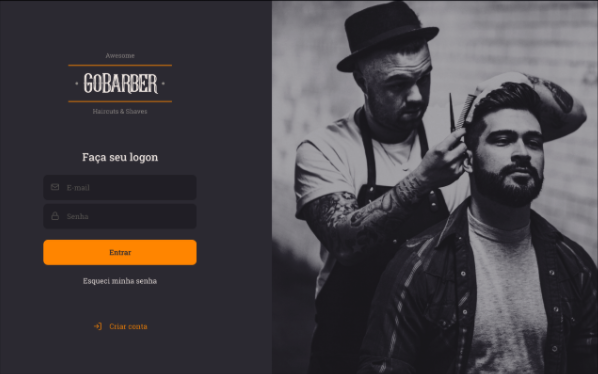

<div align="center" id="top">
  

  &#xa0;

  <!-- <a href="https://primeiroprojetonode.netlify.app">Demo</a> -->
</div>

<h1 align="center">Go Barber - Backend</h1>

<p align="center">
  

  

  

  

  <!--  -->

  <!--  -->

  <!--  -->
</p>

<!-- Status -->

<h4 align="center">
	🚧  Backend aplicação Go Barber 🚀 Under construction...  🚧
</h4>

<hr>

<p align="center">
  <a href="#dart-about">About</a> &#xa0; | &#xa0;
  <a href="#sparkles-features">Features</a> &#xa0; | &#xa0;
  <a href="#rocket-technologies">Technologies</a> &#xa0; | &#xa0;
  <a href="#white_check_mark-requirements">Requirements</a> &#xa0; | &#xa0;
  <a href="#checkered_flag-starting">Starting</a> &#xa0; | &#xa0;
  <a href="#memo-license">License</a> &#xa0; | &#xa0;
  <a href="https://github.com/fabramosdev" target="_blank">Author</a>
</p>

<br>

## :dart: About ##

Go Barber é um sistema de agendamento onde o cliente poderá marcar seu atedimento com seu cabeleireiro/barbeiro
predileto.

## :sparkles: Features ##

:heavy_check_mark: Criação de agendamentos (Appointments)
:heavy_check_mark: Cadastro de usuários
:heavy_check_mark: Aplicativo Web (para o Barbeiro) e mobile (para o Cliente)

## :rocket: Technologies ##

The following tools were used in this project:

- [Node.js](https://nodejs.org/en/)
- [express](https://#/)
- [TypeORM](https://#/)
- [TypeScript](https://www.typescriptlang.org/)
- [Postgres](https://#/)
- [Redis](https://#/)

## :white_check_mark: Requirements ##

Before starting :checkered_flag:, you need to have [Git](https://git-scm.com) and [Node](https://nodejs.org/en/) installed.

## :checkered_flag: Starting ##

```bash
# Clone this project
$ git clone https://github.com/fabramosdev/gostack-gobarber-backend

# Access
$ cd gostack-gobarber-backend

# Install dependencies
$ yarn

# Run the project
$ yarn dev:server

# The server will initialize in the <http://localhost:3333>
```

## :memo: License ##

This project is under license from MIT. For more details, see the [LICENSE](LICENSE.md) file.


Made with :heart: by <a href="https://github.com/fabramosdev" target="_blank">Fabiano Ramos</a>

&#xa0;

<a href="#top">Back to top</a>
